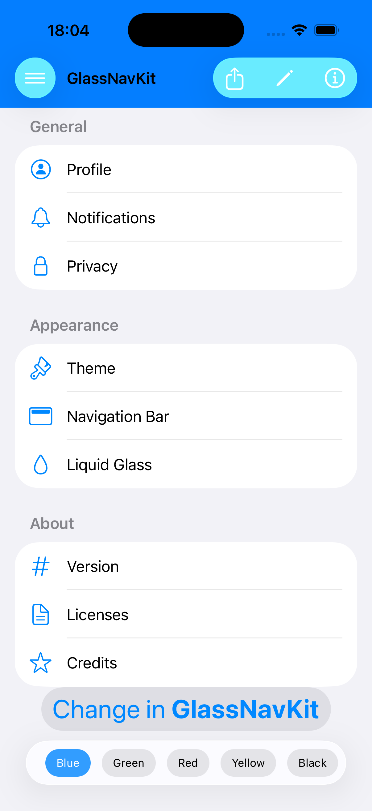
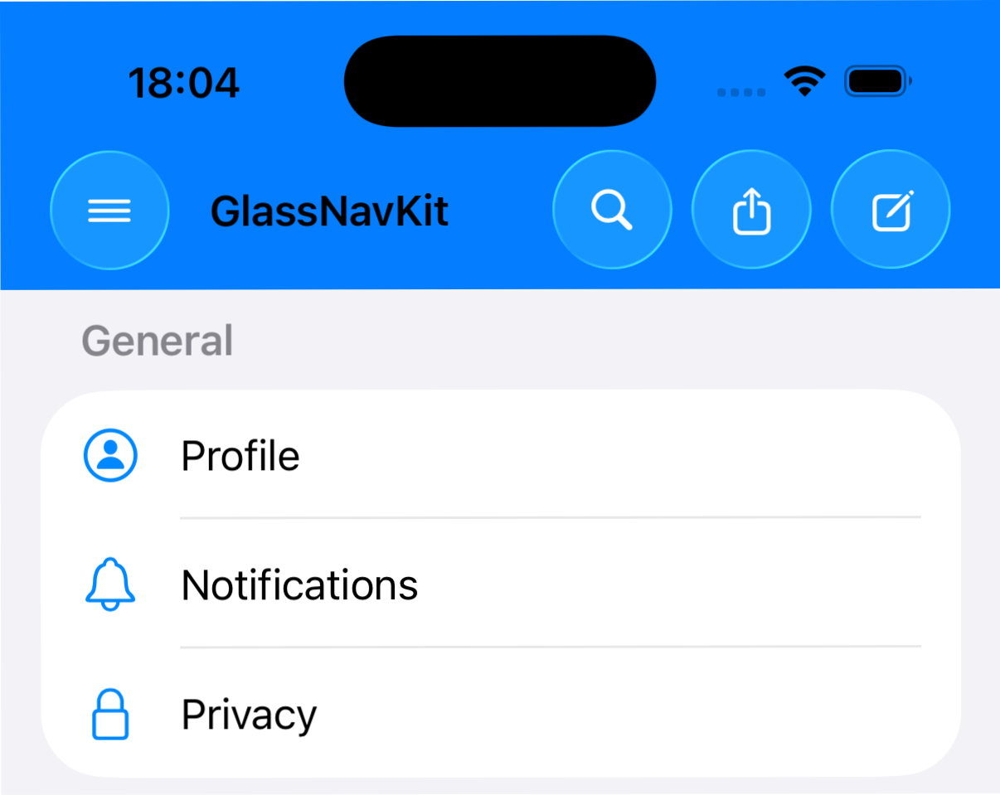

# GlassNavKit

## Important Notes

The purpose of this library is to share the problem of implementing **Liquid Glass** on **NavigationBars with a colored background**.  
Transparent liquid glass **cannot be reliably achieved using `ToolbarItem`**, especially when `List` or `ScrollView` are involved.

**NB:** if a native and official solution from Apple exists (or will be introduced), I would be more than happy to **remove this library** and adopt a better and cleaner approach.

---

## Description

**GlassNavKit** is designed to assist developers who need to implement a **Liquid Glass effect** on **custom NavigationBars** with:
- fully colored backgrounds
- `ToolbarItem` support
- white or customizable icons
- consistent behavior within `List` and `ScrollView`

The library acts as a workaround for current SwiftUI limitations, allowing developers to achieve a visually consistent transparent glass effect without complex hacks, while keeping the code modular and maintainable.

## ToolbarContent vs GlassToolbarItem

`ToolbarContent` represents the standard type for all toolbar items in SwiftUI, but it does not provide full control over the shared background of the bar.  
This can lead to conflicts with Liquid Glass effects when using colored or transparent NavigationBars.

`GlassToolbarItem` extends the concept by providing:
- compatibility with shared NavigationBar backgrounds
- elegant fallback for older iOS versions
- easy reuse in complex layouts and design systems

### Visual Example

*Standard ToolbarItem in a colored NavigationBar*

*GlassToolbarItem maintaining the Liquid Glass effect*

<video src="assets/standard_toolbaritem_demo.m4v" controls width="600">
Your browser does not support the video tag.
</video>
*Demo video showing GlassToolbarItem in action*

<video src="assets/glass_toolbaritem_demo.m4v" controls width="600">
Your browser does not support the video tag.
</video>
*Demo video showing GlassToolbarItem in action*

---

## Why It Exists

At the moment:
- `glassEffect(.clear)` cannot always be applied directly to `ToolbarItem`
- with `List` and `ScrollView`, the glass behavior is often inconsistent
- colored `NavigationBar`s easily break the Liquid Glass effect

GlassNavKit attempts to bridge these gaps without drastically altering the app’s architecture.

---

## Project Status

⚠️ **Work in progress**  
This library:
- does not claim to be the definitive solution
- may be superseded by future native APIs
- is designed to be easily removable

Feedback, suggestions, and improvements are welcome.

---

## License

MIT License  
Feel free to use, modify, and integrate this library into your projects.
